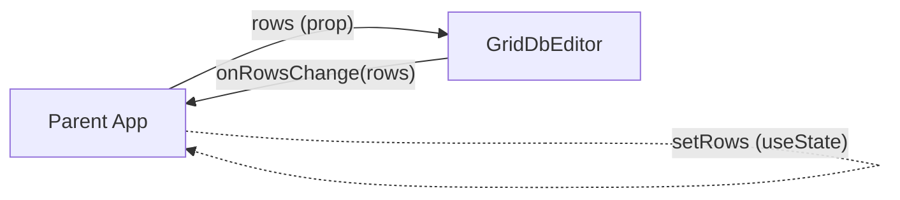
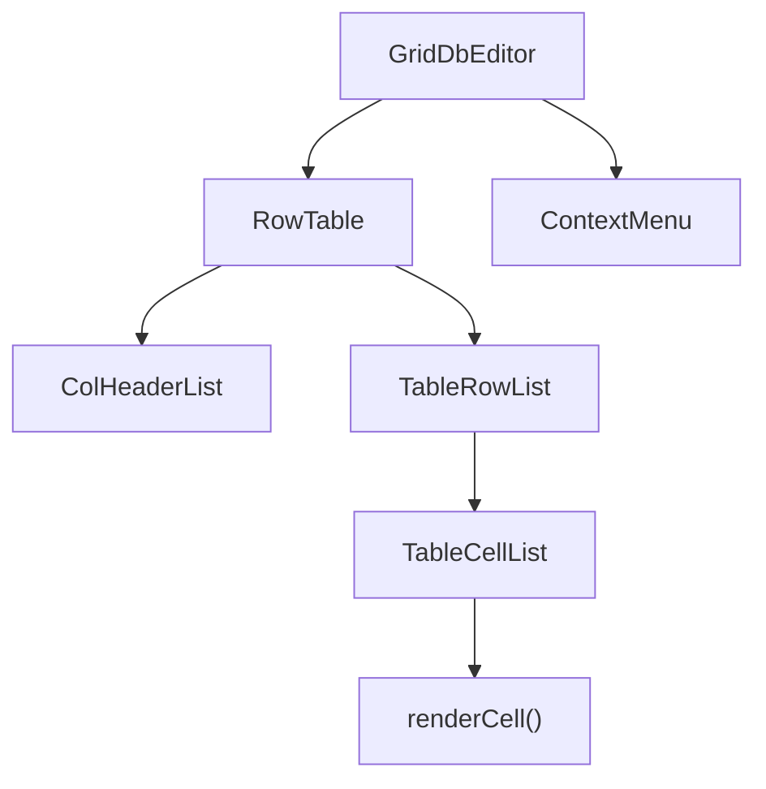
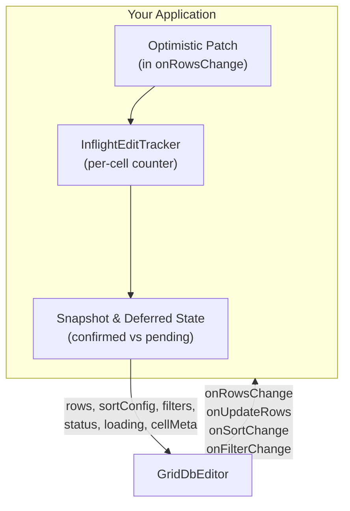

<p align="center">
  
</p>

<p align="center">
  
  
  
  
</p>

A schema-bound data grid for React — built for keyboard-driven bulk editing of structured datasets.

GridDbEditor sits between a rigid single-record form and a free-form spreadsheet. It combines the speed of Excel-style interaction (arrow keys, fill drag, copy/paste, undo/redo) with the data integrity of a fixed schema and built-in async backend integration.

<p align="center">
  
</p>

> **[Full Demo](https://sebastianbaltes.github.io/react-grid-db-editor/)** — all features, async backend simulation, 8 themes
>
> **[Simple Demo](https://sebastianbaltes.github.io/react-grid-db-editor/simple.html)** — minimal setup

---

## Table of Contents

- [Features](#features)
- [Installation](#installation)
- [Quick Start](#quick-start)
- [Architecture](#architecture)
- [API Reference](#api-reference)
- [Built-in Editors](#built-in-editors)
- [Custom Editors](#custom-editors)
- [Theming](#theming)
- [Internationalisation (i18n)](#internationalisation-i18n)
- [Backend Integration Guide](#backend-integration-guide)
- [Comparison & When to Use](#comparison--when-to-use)
- [Performance](#performance)
- [Development](#development)
- [License](#license)

---

## Features

### Editing & Interaction

- **Spreadsheet-style editing** — click, Enter, or F2 to edit; Escape to cancel
- **Fast row creation** — Alt+Insert (or the footer button) adds rows and drops the cursor straight into the first editable cell, scrolled into view and ready to type (configurable via `focusNewRowOnCreate` / `enableCreateRowsHotkey`)
- **Keyboard navigation** — arrow keys, Tab, Home/End, Page Up/Down
- **Multi-cell selection** — Shift+Arrow for ranges, click-drag
- **Column selection** — click column header area to select entire column (configurable via `colSelection` prop)
- **Fill drag** — Excel-style fill handle to copy values across cells
- **Copy & Paste** — Ctrl+C / Ctrl+V with tab-separated clipboard (Excel-compatible)
- **Undo / Redo** — Ctrl+Z / Ctrl+Y with full row-snapshot history
- **Search & Replace** — Ctrl+H with regex support, scoped to selection or full dataset (enable via `enableSearchReplace`)
- **Context menu** — right-click for undo/redo, insert/remove rows, copy, paste, delete, filter by value, search & replace; extensible with custom items. Items are disabled when not applicable.

### Schema & Validation

- **10 built-in column types** — String, Number, Boolean, Combobox, MultiCombobox, Date, DateTime, Time, Duration, Color
- **Custom editors** — plug in your own editor component per column
- **Per-cell validation** — `validate` function with error/warning severity and tooltips
- **Input masking** — pattern-based formatting (e.g. phone numbers, IBAN, IP addresses)
- **Dependent dropdowns** — `selectOptions` as a function of the current row
- **Number formatting** — locale-aware with configurable decimals, thousands separator, prefix/suffix

### Layout & Display

- **Sticky columns** — any number of left-pinned columns via native CSS
- **Sticky headers** — column headers remain visible when scrolling vertically
- **Column resizing** — drag column header edges; columns can be made smaller than content; widths persistable to localStorage
- **Column reordering & hiding** — drag-and-drop dialog with checkbox visibility toggles
- **Text ellipsis** — configurable auto-truncation for long values
- **Cell alignment** — per-column override; numbers right-aligned by default
- **Text wrapping** — opt-in per column
- **Empty area styling** — when few rows are displayed, the empty area below shows a distinct background color

### Sorting & Filtering

- **Multi-sort** — click headers to sort; Shift+click for secondary criteria with priority numbers
- **Per-column filters** — text input in each header; combobox dropdown for columns with options
- **Filter by value** — right-click a cell to filter by its value; clear all filters from context menu
- **Controlled or uncontrolled** — manage sort/filter state locally or drive it from your backend
- **Custom filter editors** — replace the built-in filter UI per column

### Backend Integration

- **Async callbacks with rollback** — `onCreateRows`, `onUpdateRows`, `onDeleteRows` return Promises; rejection rolls back automatically
- **Optimistic updates** — changes appear instantly; inflight tracking prevents overwrites
- **Stale data detection** — cells changed by the server are marked visually
- **`useAsyncTableState` hook** — one hook for deferred snapshots, optimistic edits, inflight tracking, status derivation
- **Cell meta state** — styles, CSS classes, tooltips, and disabled state per cell or row

### More

- **8 built-in themes** + simple CSS-variable-based custom theming
- **i18n** — all UI strings overridable via typesafe `translations` prop
- **Pagination** — standalone `<Pagination>` component, works with any list
- **Selection range listener** — `onSelectionChange` for aggregation (sum, count, average)
- **Header tooltips** — `headerTitle` per column for descriptive tooltips on column headers
- **Clickable header icons** — `headerIcons` per column renders glyphs after the label; icons with `onClick` are buttons whose click is isolated from column sorting (e.g. an FK "open target" arrow)
- **ARIA-conformant focus** — proper focus/blur behavior for accessibility

---

## Installation

```bash
npm install react-grid-db-editor
```

**Peer dependencies:** `react >= 17`, `react-dom >= 17`

The package ships TypeScript sources and type declarations.

---

## Quick Start

<p align="center">
  
</p>

```tsx
import React, { useState } from "react";
import { GridDbEditor, ColumnConfig, Row } from "react-grid-db-editor";
import "react-grid-db-editor/style.css";

const columns: ColumnConfig<any>[] = [
  { name: "id", type: "Number", readOnly: true, numberFormat: { decimalPlaces: 0 } },
  { name: "name", type: "String", required: true },
  {
    name: "salary",
    type: "Number",
    numberFormat: { decimalPlaces: 2, thousandsSeparator: true, suffix: " EUR" },
  },
  { name: "role", type: "Combobox", selectOptions: ["Admin", "User", "Guest"] },
  { name: "active", type: "Boolean" },
];

const initialRows: Row[] = [
  { id: 1, name: "Alice", salary: 72000, role: "Admin", active: true },
  { id: 2, name: "Bob", salary: 58000, role: "User", active: false },
  { id: 3, name: "Carol", salary: 64500, role: "Guest", active: true },
];

export const App = () => {
  const [rows, setRows] = useState(initialRows);

  return (
    <GridDbEditor
      rows={rows}
      columns={columns}
      onRowsChange={setRows}
      rowKey={(row) => row.id}
      numberOfStickyColums={1}
      enableSearchReplace
    />
  );
};
```

---

## Architecture

### Data Flow

GridDbEditor is a **controlled component** — it does not own the data:



Every mutation (cell edit, paste, fill drag, create/delete rows) produces a new `Row[]` array and calls:

1. **`onRowsChange(newRows)`** — always called with the complete new array
2. **`onUpdateRows` / `onCreateRows` / `onDeleteRows`** — called with only the affected rows, for targeted backend operations

### Component Tree



### Key Design Decisions

| Decision | Rationale |
| --- | --- |
| **Native `<table>` (no virtualization)** | Browser handles column widths, text wrapping, sticky positioning natively. Full CSS control. Screen-reader friendly. Trade-off: not suited for 5,000+ rows without pagination. |
| **Cursor via direct DOM manipulation** | Arrow-key movement updates CSS classes directly — no React re-renders. State updates only trigger when entering/exiting edit mode. |
| **Separate data and meta state** | `rows` is the business data; `cellMeta` is transient UI state (errors, disabled cells). They change independently. |
| **Immutable row updates** | Every mutation creates a new array. Works with React reconciliation, enables undo snapshots, and keeps `onRowsChange` simple. |
| **Optimistic updates with async rollback** | Changes appear instantly. If the backend rejects, the table rolls back and shakes briefly for visual feedback. |

---

## API Reference

### GridDbEditor Props

| Prop | Type | Required | Default | Description |
| --- | --- | --- | --- | --- |
| `rows` | `Row[]` | yes | — | Data to display. Each row is a `Record<string, any>`. |
| `columns` | `ColumnConfig<any>[]` | yes | — | Column definitions. |
| `onRowsChange` | `(rows: Row[]) => void` | — | — | Called with the full new rows array after every mutation. |
| `onCreateRows` | `(rows: Row[]) => void \| Promise<void>` | — | — | Called with newly created rows. Reject to rollback. |
| `onUpdateRows` | `(rows: Row[]) => void \| Promise<void>` | — | — | Called with updated rows. Reject to rollback. |
| `onDeleteRows` | `(rows: Row[]) => void \| Promise<void>` | — | — | Called with deleted rows. Reject to rollback. |
| `onUndo` | `(recoveredRows: Row[]) => void \| Promise<void>` | — | — | Called on undo. Reject to rollback. |
| `onRedo` | `(recoveredRows: Row[]) => void \| Promise<void>` | — | — | Called on redo. Reject to rollback. |
| `rowKey` | `(row: Row, index: number) => string` | — | `(_, i) => ""+i` | Stable key for each row. |
| `numberOfStickyColums` | `number` | — | `0` | Number of left-pinned columns. |
| `colSelection` | `boolean` | — | `false` | Enable column selection by clicking the column header area (not the label). Label click always sorts. |
| `enableSearchReplace` | `boolean` | — | `false` | Enable the Search & Replace dialog (Ctrl+H) and context menu entry. |
| `focusNewRowOnCreate` | `boolean` | — | `true` | After creating rows (footer button, Alt+Insert hotkey, or context-menu insert above/below), move the cursor to the first editable cell of the first new row (in display order, so it respects sort/filter), scroll it into view, and enter edit mode so the user can type immediately. Set to `false` to opt out. |
| `enableCreateRowsHotkey` | `boolean` | — | `true` | Enable the built-in **Alt+Insert** shortcut that triggers "Create Rows" (respecting the row-count input). Set to `false` to disable it. |
| `sortConfig` | `SortConfig` | — | _(internal)_ | Controlled sort state. |
| `onSortChange` | `(config: SortConfig) => void` | — | — | Called when the user changes sort. |
| `filters` | `FilterState` | — | _(internal)_ | Controlled filter state. |
| `onFilterChange` | `(filters: FilterState) => void` | — | — | Called when the user changes a filter. |
| `cellMeta` | `CellMetaMap` | — | — | Styles, disabled state, tooltips per cell/row. |
| `textEllipsisLength` | `number` | — | — | Truncate long text to this length with `[...]`. |
| `translations` | `Partial<TableTranslations>` | — | English | Override built-in UI strings. |
| `extraContextMenuItems` | `CustomContextMenuItem[]` | — | `[]` | Custom entries for the right-click menu. |
| `caption` | `string` | — | — | Accessible caption (rendered as visually-hidden `<caption>` element). |
| `status` | `TableStatus` | — | — | Status indicator in the toolbar (`ok` / `info` / `warning` / `error`). |
| `loading` | `boolean` | — | `false` | Shows spinners on active filters; sets `cursor: wait`. |
| `pendingSortColumn` | `string` | — | — | Shows a spinner instead of the sort arrow on this column. |
| `pendingFilterColumns` | `string[]` | — | — | Shows spinners in these filter inputs. |
| `columnWidths` | `Record<string, number>` | — | — | Column name to pixel width for resizable columns. |
| `onColumnResize` | `(colName: string, width: number) => void` | — | — | Called on column resize. |
| `onSelectionChange` | `(selection: SelectionInfo) => void` | — | — | Called when the selection range changes. |
| `shakeRef` | `MutableRefObject<(() => void) \| null>` | — | — | Ref to trigger the shake animation programmatically. |

### ColumnConfig\<T\>

```ts
interface ColumnConfig<T> {
  name: string;           // Column key in the row record
  type: string;           // "String" | "Number" | "Boolean" | "Combobox" | "MultiCombobox"
                          // | "Date" | "DateTime" | "Time" | "Duration" | "Color"
  label?: string;         // Display label (defaults to name)
  readOnly?: boolean;
  required?: boolean;     // Adds col-required class
  editor?: Editor<T>;     // Custom editor (overrides type-based lookup)
  selectOptions?: string[] | ((row: Row) => string[]);
                          // For Combobox/MultiCombobox — static or dynamic (dependent dropdowns)
  freeText?: boolean;     // Allow values not in selectOptions (default: true)
  multiselect?: boolean;  // Multi-select mode
  enabledIf?: (row: Row) => boolean;
  validate?: (value: any) => boolean | ValidationResult;
  numberFormat?: NumberFormat;
  dateFormat?: DateFormat;
  dateTimeFormat?: DateTimeFormat;
  timeFormat?: TimeFormat;
  durationFormat?: DurationFormat;
  inputMask?: string;     // # = digit, A = letter, * = any; rest is literal
  align?: "left" | "right" | "center";
  headerTitle?: string;   // Tooltip shown on column header (HTML title attribute)
  headerIcons?: HeaderIcon[]; // Icons after the label; with onClick = clickable button, click isolated from sort
  filterable?: boolean;   // Hide filter input (default: true)
  filterEditor?: FilterEditor;
  dialogTitle?: string;   // Title for textarea dialog editor
  wrap?: boolean;         // Allow text wrapping (default: false)
  className?: string;     // Extra CSS class(es) on <th> and <td>
  serverOwned?: boolean;  // Always use backend value during merge (default: false)
}
```

### Type Definitions

<details>
<summary>NumberFormat</summary>

```ts
interface NumberFormat {
  decimalPlaces?: number;
  thousandsSeparator?: boolean; // default: true
  locale?: string;             // BCP 47, e.g. "de-DE"
  prefix?: string;             // e.g. "$ "
  suffix?: string;             // e.g. " EUR"
}
```

</details>

<details>
<summary>DateFormat / DateTimeFormat / TimeFormat / DurationFormat</summary>

```ts
interface DateFormat {
  locale?: string;
  dateStyle?: "full" | "long" | "medium" | "short";
  options?: Intl.DateTimeFormatOptions;
}

interface DateTimeFormat {
  locale?: string;
  dateStyle?: "full" | "long" | "medium" | "short";
  timeStyle?: "full" | "long" | "medium" | "short";
  options?: Intl.DateTimeFormatOptions;
}

interface TimeFormat {
  locale?: string;
  showSeconds?: boolean;
  hourCycle?: "h11" | "h12" | "h23" | "h24";
}

interface DurationFormat {
  style?: "short" | "long" | "iso"; // "short" = "2h 30m", "long" = "2 hours 30 minutes"
}
```

</details>

<details>
<summary>SortConfig / FilterState</summary>

```ts
interface SortCriterion {
  column: string;
  direction: "asc" | "desc";
}
type SortConfig = SortCriterion[] | null;

type FilterState = Record<string, string>;
```

**Multi-sort interaction:** Click = single-sort. Shift+Click = add/cycle criterion. Priority numbers (1 2 3) appear next to sort arrows.

</details>

<details>
<summary>CellMetaMap / CellMeta / RowMeta</summary>

```ts
interface CellMeta {
  style?: React.CSSProperties;
  className?: string;
  disabled?: boolean;
  title?: string;
}

interface RowMeta {
  style?: React.CSSProperties;
  className?: string;
  title?: string;
}

type CellMetaMap = Record<string, {
  row?: RowMeta;
  cells?: Record<string, CellMeta>;
}>;
```

The map is keyed by the value returned from `rowKey`.

</details>

<details>
<summary>ValidationResult</summary>

```ts
interface ValidationResult {
  message: string;
  severity: "warning" | "error";
}
```

`validate` may return `true`, `false`, or a `ValidationResult`. Results apply `cell-error` / `cell-warning` CSS classes and set the tooltip.

</details>

<details>
<summary>Editor&lt;T&gt;</summary>

```ts
type EditorParams<T> = {
  value: T;
  row: Record<string, T>;
  editing: boolean;
  columnConfig: ColumnConfig<T>;
  onChange: (value: T) => void;
  textEllipsisLength?: number;
  initialEditValue: string | null; // Character typed to open edit mode
};

type Editor<T> = (params: EditorParams<T>) => JSX.Element;
```

</details>

<details>
<summary>SelectionInfo</summary>

```ts
interface SelectionInfo {
  range: { startRow: number; endRow: number; startCol: number; endCol: number };
  hasSelection: boolean;
}
```

</details>

<details>
<summary>TableStatus</summary>

```ts
interface TableStatus {
  text: string;
  severity: "ok" | "info" | "warning" | "error";
}
```

| Severity | Icon | Use case |
| --- | --- | --- |
| `ok` | check | All data synced |
| `info` | spinner | Request in flight |
| `warning` | warning | Stale data detected |
| `error` | warning (red) | Operation failed |

</details>

<details>
<summary>TableTranslations</summary>

```ts
interface TableTranslations {
  "Create Rows": string;
  "Enter or select...": string;
  "Filter or add value...": string;
  "-- select --": string;
  "Press Enter to save": string;
  "Press Enter to add": string;
  "Insert row above": string;
  "Insert row below": string;
  "Remove rows": string;
  "Copy content": string;
  "Paste content": string;
  "Delete content": string;
  "Search & Replace": string;
  Undo: string;
  Redo: string;
  "Filter by value": string;
  "Clear filter": string;
  Yes: string;
  No: string;
}
```

</details>

<details>
<summary>CustomContextMenuItem & TableContextState</summary>

```ts
interface TableContextState {
  selectionRange: { startRow: number; endRow: number; startCol: number; endCol: number };
  selectedRows: Row[];
  displayRows: Row[];
  rows: Row[];
  columns: ColumnConfig<any>[];
  cellMeta?: CellMetaMap;
}

type CustomContextMenuItem =
  | { label: string; shortcut?: string; onClick: (state: TableContextState) => void }
  | "---";
```

</details>

### Automatic CSS Classes

Cells and headers receive these classes automatically:

| Class | Applied to | Condition |
| --- | --- | --- |
| `col-type-{type}` | `<th>`, `<td>` | Always (e.g. `col-type-Number`) |
| `col-required` | `<th>`, `<td>` | `required: true` |
| `col-readonly` | `<th>`, `<td>` | readOnly / disabled |
| `col-wrap` | `<th>`, `<td>` | `wrap: true` |
| `col-selected` | `<th>` | Column is selected (via `colSelection`) |
| `cell-error` | `<td>` | Validation error |
| `cell-warning` | `<td>` | Validation warning |
| `cell-ellipsis` | `<td>` | Text exceeds `textEllipsisLength` |
| `cell-disabled` | `<td>` | `cellMeta.disabled` |

---

## Built-in Editors

| Type | Behaviour |
| --- | --- |
| **String** | Text input. Supports `inputMask` for pattern-based formatting. |
| **Number** | Locale-aware formatted input. Right-aligned by default. Prefix/suffix via CSS pseudo-elements. |
| **Boolean** | Always-visible checkbox. Enter toggles without entering edit mode. |
| **Combobox** | Searchable single-select dropdown. `freeText` allows custom values. |
| **MultiCombobox** | Multi-select variant with checkboxes. Each toggle commits immediately. |
| **Date** | Free-text + native date picker. Internal: `YYYY-MM-DD`. Display via `Intl.DateTimeFormat`. |
| **DateTime** | Free-text + native datetime picker. Internal: ISO datetime string. |
| **Time** | Free-text + native time picker. Parses 12h and 24h formats. |
| **Duration** | Multi-format parser (`2h 30m`, `2:30`, `PT2H30M`). Normalizes to ISO 8601. |
| **Color** | Hex input with swatch preview + native color picker. |

### Number Editor Details

In edit mode, prefix/suffix are rendered as CSS `::before`/`::after` decorations. Single-clicking an already-selected cell places the cursor at the click position. Typing a digit opens edit mode with that character pre-filled.

### Combobox Keyboard Contract

| Key | Single-select | Multi-select |
| --- | --- | --- |
| Arrow Up/Down | Move highlight | Move highlight |
| Enter (highlighted) | Select, advance to next row | Toggle, commit, advance |
| Enter (no highlight) | Commit typed text | Add as custom entry |
| Space | — | Toggle highlighted option |
| Tab | Commit, advance to next cell | Commit, advance to next cell |
| Escape | Discard changes | Discard changes |

### Input Masking

```ts
{ name: "phone", type: "String", inputMask: "+## ### ########" }
{ name: "iban",  type: "String", inputMask: "AA## #### #### #### #### ##" }
```

`#` = digit, `A` = letter, `*` = any character. All other characters are literal separators.

### Dependent Dropdowns

```ts
{
  name: "city",
  type: "Combobox",
  selectOptions: (row) => {
    const cities: Record<string, string[]> = {
      Germany: ["Berlin", "Munich", "Hamburg"],
      France: ["Paris", "Lyon", "Marseille"],
    };
    return cities[row.country] ?? [];
  },
}
```

---

## Custom Editors

Provide your own editor component per column:

```tsx
const RatingEditor: Editor<number> = ({ value, editing, onChange }) => {
  if (!editing) return <span>{"*".repeat(value || 0)}</span>;
  return (
    <input
      type="range"
      min={0} max={5}
      value={value || 0}
      onChange={(e) => onChange(Number(e.target.value))}
      onKeyDown={(e) => e.stopPropagation()} // prevent table key handling
    />
  );
};

const columns = [{ name: "rating", type: "custom", editor: RatingEditor }];
```

> **Important:** Call `e.stopPropagation()` on `onKeyDown` inside your editor to prevent the table's keyboard handler from intercepting events. Let Enter and Tab bubble through so the table can commit/navigate.

---

## Theming

GridDbEditor ships with 8 themes and a CSS-variable-based theming system.

### Built-in Themes

| Theme | Description |
| --- | --- |
| **Light** | Clean, neutral default |
| **Dark** | Dark backgrounds, styled scrollbars |
| **Excel Classic** | Traditional Excel — gray headers, green accents |
| **Google Sheets** | White and blue, thin borders |
| **Material** | MUI DataTable style — borderless cells, elevation shadows |
| **Numbers** | Apple Numbers — clean, strong gray headers |
| **Material 3** | Material You — purple scheme, rounded surfaces |
| **High Contrast** | WCAG AAA contrast ratios, strong borders |

### Custom Themes

A theme is a CSS file that sets custom properties on `:root`. The structural layout lives in `core/base.css` and never needs to change.

```css
/* my-theme.css */
:root {
  --ct-bg: #fff;
  --ct-text: #333;
  --ct-font: "My Font", sans-serif;
  --ct-border: #ddd;
  --ct-header-bg: #f5f5f5;
  --ct-selected-outline: #0066cc;
  /* see any built-in theme for the full list of variables */
}
```

Import your theme CSS after `base.css`. The demo app demonstrates runtime theme switching, but a static CSS import works for most use cases.

---

## Internationalisation (i18n)

All built-in UI strings are overridable via the typesafe `translations` prop:

```tsx
<GridDbEditor
  translations={{
    "Create Rows": "Zeilen hinzufuegen",
    "Remove rows": "Zeilen loeschen",
    "Insert row above": "Zeile darueber einfuegen",
    "Insert row below": "Zeile darunter einfuegen",
    "Copy content": "Inhalt kopieren",
    "Paste content": "Inhalt einfuegen",
    "Delete content": "Inhalt loeschen",
    Undo: "Rueckgaengig",
    Redo: "Wiederherstellen",
    "Search & Replace": "Suchen & Ersetzen",
    "Filter by value": "Nach Wert filtern",
    "Clear filter": "Filter loeschen",
  }}
/>
```

Unspecified keys fall back to English defaults. The `TableTranslations` interface is exported — TypeScript flags unknown or misspelled keys at compile time.

---

## Backend Integration Guide

GridDbEditor is designed as a view layer for backend-managed data. It provides building blocks you compose into your own integration pattern.

### Architecture Overview



### Controlled Sort & Filter

Pass `sortConfig` and `filters` as props to let the backend handle queries. The table calls `onSortChange` / `onFilterChange` instead of filtering locally.

```tsx
const [sort, setSort] = useState<SortConfig>(null);
const [filters, setFilters] = useState<FilterState>({});
const [rows, setRows] = useState<Row[]>([]);

useEffect(() => {
  fetchFromBackend(sort, filters).then(setRows);
}, [sort, filters]);

<GridDbEditor
  rows={rows}
  columns={columns}
  onRowsChange={setRows}
  sortConfig={sort}
  onSortChange={setSort}
  filters={filters}
  onFilterChange={setFilters}
/>
```

**Key principle:** Pass the **confirmed** sort/filter to GridDbEditor (so it doesn't re-sort old data), but update the **requested** state immediately (so spinners show via `pendingSortColumn` / `pendingFilterColumns`).

### Async Callbacks & Rollback

`onCreateRows`, `onUpdateRows`, and `onDeleteRows` may return a `Promise<void>`. On rejection, the table rolls back to the pre-mutation state and shakes briefly for visual feedback.

```tsx
<GridDbEditor
  onUpdateRows={async (updatedRows) => {
    await fetch("/api/rows", { method: "PATCH", body: JSON.stringify(updatedRows) });
    // On success: nothing to do — table already shows the new state.
    // On failure: throw -> table rolls back automatically.
  }}
/>
```

### InflightEditTracker

Prevents race conditions where a backend response overwrites a user edit that hasn't been confirmed yet.

```ts
import { InflightEditTracker } from "react-grid-db-editor";

const tracker = new InflightEditTracker();

// Track which cells changed (increments per-cell counter):
const batch = tracker.trackChanges(oldRows, newRows, columns, rowKeyFn);

// When the backend confirms:
tracker.resolveBatch(batch);

// Merge backend data with local state (respects inflight counters + serverOwned):
const merged = tracker.mergeRows(localRows, backendRows, columns, localKeyFn, backendKeyFn);
```

**Merge rules per cell:**

| Condition | Result |
| --- | --- |
| `serverOwned: true` | Always use backend value |
| Inflight counter > 0 | Keep local value (edit pending) |
| Inflight counter === 0 | Use backend value |

### useAsyncTableState Hook

Encapsulates all of the above in a single hook — deferred snapshots, optimistic edits, inflight tracking, stale detection, and status derivation:

```tsx
import { useAsyncTableState } from "react-grid-db-editor";

const asyncState = useAsyncTableState({
  allRows, columns, sortConfig, filters,
  rowKeyFn: (row) => row.id,
  pageItems, pageRows, totalFilteredRows,
  delayMs: 2000,
});

<GridDbEditor
  rows={asyncState.displayRows}
  sortConfig={asyncState.displaySortConfig}
  filters={asyncState.displayFilters}
  status={asyncState.status}
  loading={asyncState.loading}
  cellMeta={{ ...staticMeta, ...asyncState.asyncCellMeta }}
  onRowsChange={asyncState.handleRowsChange}
  onUpdateRows={asyncState.handleUpdateRows}
  onCreateRows={() => asyncState.handleAsyncOp("create")}
  onDeleteRows={() => asyncState.handleAsyncOp("delete")}
/>
```

<details>
<summary>Full list of returned properties</summary>

| Property | Type | Description |
| --- | --- | --- |
| `displayRows` | `Row[]` | Confirmed rows |
| `displaySortConfig` | `SortConfig` | Confirmed sort |
| `displayFilters` | `FilterState` | Confirmed filters |
| `displayItems` | `Array<{row, origIdx}>` | Page items with index mapping |
| `displayTotalFilteredRows` | `number` | For pagination |
| `status` | `TableStatus \| undefined` | Auto-derived status |
| `loading` | `boolean` | Deferred load in progress |
| `pendingSortColumn` | `string \| undefined` | For sort spinner |
| `pendingFilterColumns` | `string[] \| undefined` | For filter spinners |
| `asyncCellMeta` | `CellMetaMap` | Merged validation + stale + unsaved meta |
| `handleRowsChange` | `(rows) => void` | Optimistic patch + inflight tracking |
| `handleUpdateRows` | `(rows) => Promise` | Batch resolve + validation |
| `handleAsyncOp` | `(label) => Promise` | Generic async operation |
| `setError` | `(msg) => void` | Set custom error message |
| `markCellsUnsaved` | `(cells) => void` | Mark cells as unsaved |
| `consumeLastBatch` | `() => batch` | Get tracked changes |
| `resolveBatch` | `(batch) => void` | Resolve inflight counters |
| `clearAsyncMeta` | `() => void` | Clear all async meta state |

</details>

### Backend Validation via cellMeta

When the backend returns field-level errors, apply them as dynamic `cellMeta`:

```tsx
onUpdateRows={async (rows) => {
  const response = await api.updateRows(rows);
  if (response.validationErrors) {
    const meta: CellMetaMap = {};
    for (const err of response.validationErrors) {
      meta[err.rowKey] = {
        cells: {
          ...meta[err.rowKey]?.cells,
          [err.column]: {
            className: err.severity === "warning" ? "cell-warning" : "cell-error",
            title: err.message,
          },
        },
      };
    }
    setValidationMeta(meta);
  }
}}
```

### Demo Modes

The included example app (`src/examples/example.tsx`) demonstrates all integration patterns:

| Mode | Demonstrates |
| --- | --- |
| Local (sync) | Baseline — no async |
| Backend (100 ms) | Realistic fast backend |
| Backend (2 s) | Slow backend — visible spinners, deferred snapshots |
| Error (2 s) | Server errors with rollback |
| Connection error | Network failure with auto-retry |
| Validation (2 s) | Field-level backend validation via cellMeta |
| Stale (2 s) | Server-side data normalization with stale detection |

---

## Pagination

`Pagination` is a standalone component — no coupling to `GridDbEditor`. Use it with any paginated list.

```tsx
import { Pagination } from "react-grid-db-editor";

<Pagination
  totalRows={300}
  page={currentPage}
  pageSize={pageSize}
  onPageChange={setPage}
  onPageSizeChange={(ps) => { setPageSize(ps); setPage(1); }}
/>
```

<details>
<summary>PaginationProps</summary>

| Prop | Type | Default | Description |
| --- | --- | --- | --- |
| `totalRows` | `number` | required | Total row count (pass filtered count when filters are active). |
| `page` | `number` | required | Current 1-based page. |
| `pageSize` | `number` | required | Current page size. `0` = all rows. |
| `onPageChange` | `(page: number) => void` | required | Page button clicked. |
| `onPageSizeChange` | `(pageSize: number) => void` | required | Page size changed. |
| `pageSizeOptions` | `number[]` | `[10,25,50,100,250,500,1000,0]` | Available sizes. `0` renders as "All". |
| `maxVisiblePages` | `number` | `20` | Max page buttons before collapsing. |
| `labels` | `Partial<PaginationLabels>` | — | Override display strings. |
| `className` | `string` | — | Additional CSS class. |

</details>

---

## Extensible Context Menu

Add custom items to the right-click menu via `extraContextMenuItems`. Each item receives a full `TableContextState` snapshot.

```tsx
const myItems: CustomContextMenuItem[] = [
  {
    label: "Export selection as CSV",
    onClick: ({ selectedRows, columns }) => {
      const header = columns.map((c) => c.label ?? c.name).join(",");
      const body = selectedRows
        .map((r) => columns.map((c) => r[c.name] ?? "").join(","))
        .join("\n");
      navigator.clipboard.writeText(header + "\n" + body);
    },
  },
  "---",
  {
    label: "Mark as reviewed",
    shortcut: "Ctrl+M",
    onClick: ({ selectedRows }) => selectedRows.forEach((r) => markReviewed(r.id)),
  },
];

<GridDbEditor extraContextMenuItems={myItems} />
```

### Built-in Context Menu Items

The context menu includes these items by default:

| Item | Shortcut | Disabled when |
| --- | --- | --- |
| Undo | Ctrl+Z | No undo history |
| Redo | Ctrl+Y | No redo history |
| Insert row above | | |
| Insert row below | | |
| Remove rows | | No rows |
| Copy content | Ctrl+C | No rows |
| Paste content | Ctrl+V | |
| Delete content | Delete | No rows |
| Filter by value | | No rows |
| Clear filter | | No active filter |
| Search & Replace | Ctrl+H | Only when `enableSearchReplace` |

The context menu does not appear when an editor dialog is open or when right-clicking on column header filter inputs. Custom items appear after a separator below the built-in items.

---

## Comparison & When to Use

| Feature | GridDbEditor | Handsontable | AG Grid (Community) | TanStack Table |
| :--- | :--- | :--- | :--- | :--- |
| **Primary goal** | **DB bulk editing** | Spreadsheet clone | Enterprise grid | Headless logic |
| **Rendering** | Native `<table>` | Virtual DOM | Virtual (div/canvas) | User-defined |
| **Undo / Redo** | Built-in | Pro only | Manual | Manual |
| **Async Rollback** | Built-in | Manual | Manual | Manual |
| **Range Selection** | Included | Included | Enterprise only | Manual |
| **Sticky Columns** | Native CSS | JS-based | JS-based | Manual |
| **i18n** | Built-in | Included | Included | Manual |
| **License** | **MIT** | Commercial | MIT / Commercial | MIT |

### When to use GridDbEditor

- Internal admin tools, back-office dashboards, data management UIs
- Data with a fixed schema (rows and columns)
- Users editing 10-500 rows at once, or any size with pagination
- Projects that sync changes to an API with minimal boilerplate

### When to use something else

- **5,000+ rows without pagination** — use a virtualized grid (AG Grid, Glide Data Grid)
- **Free-form data** with arbitrary columns or formulas — use Handsontable or Luckysheet
- **Complete UI control** with only the logic — use TanStack Table (headless)

---

## Performance

The cursor/selection system bypasses React re-renders entirely via direct DOM manipulation (`classList`, `style`). State updates only trigger when entering/exiting edit mode.

| Optimization | Technique | Measured Impact |
| --- | --- | --- |
| **RAF-throttled mousemove** | Batch drag events to 60/s via `requestAnimationFrame` | **86% less CPU time** (130 ms to 18 ms for 300 events) |
| **CSS containment** | `contain: content` on cells limits reflow scope | ~4% on isolated pages, more in complex layouts |
| **GPU compositing** | `will-change` on selection/fill overlays | Eliminates repaints of underlying cells |

### Why no virtualization?

GridDbEditor deliberately uses native `<table>` elements instead of virtualized rendering. This gives you:

- **Native column sizing** — the browser calculates column widths based on content, no manual measurement needed
- **Native sticky positioning** — `position: sticky` on headers and columns, no JS scroll listeners
- **Full CSS control** — standard selectors work on every cell, no cell-recycling side effects
- **Screen reader support** — native table semantics, no ARIA workarounds
- **Simpler mental model** — inspect the DOM and see real table rows

The trade-off: not suited for 5,000+ rows without pagination. For most admin/back-office use cases (10-500 rows per page), native tables outperform virtualized grids in perceived responsiveness because there is zero scroll jank.

For detailed benchmarks and methodology, see [PERFORMANCE.md](PERFORMANCE.md).

---

## Development

```bash
git clone https://github.com/SebastianBaltes/react-grid-db-editor.git
cd react-griddbeditor
npm install
npm start            # Dev server at http://localhost:5173/
npm run test:e2e     # Playwright E2E tests
```

See [CONTRIBUTING.md](CONTRIBUTING.md) for project structure, build commands, and architecture details.

---

## License

MIT — see [license.md](license.md)
